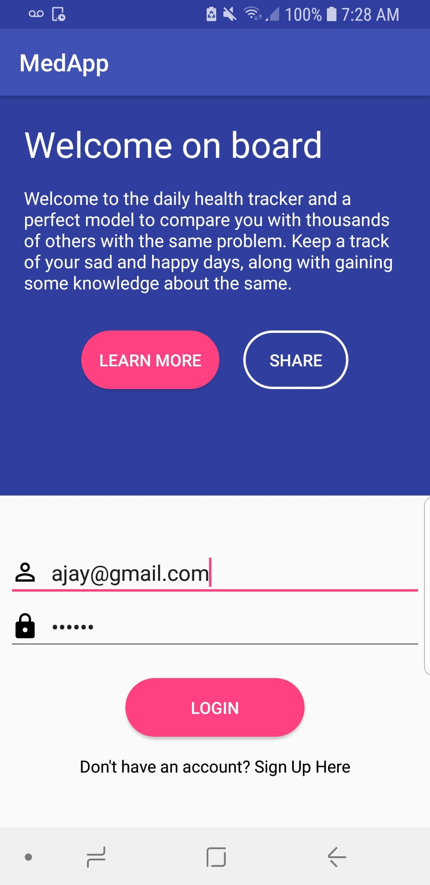
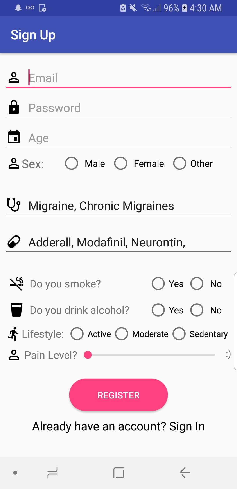
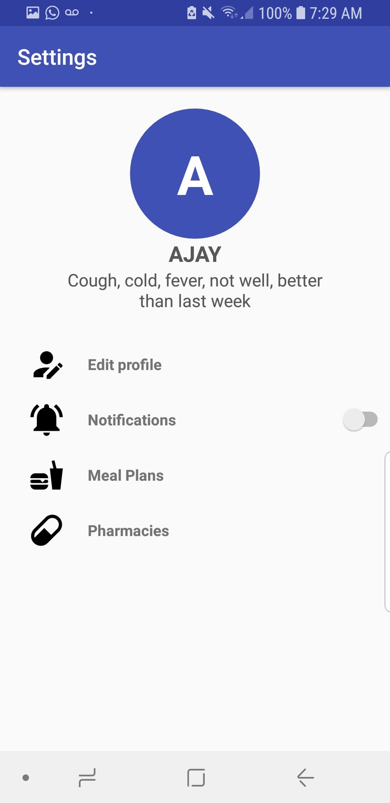
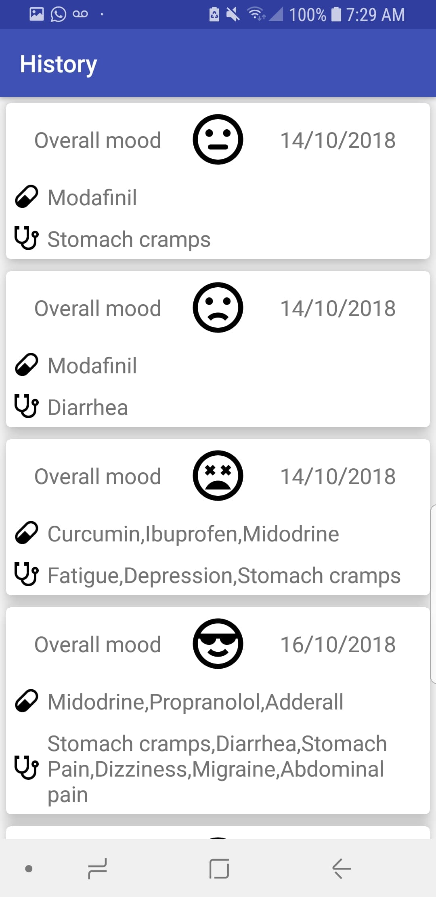
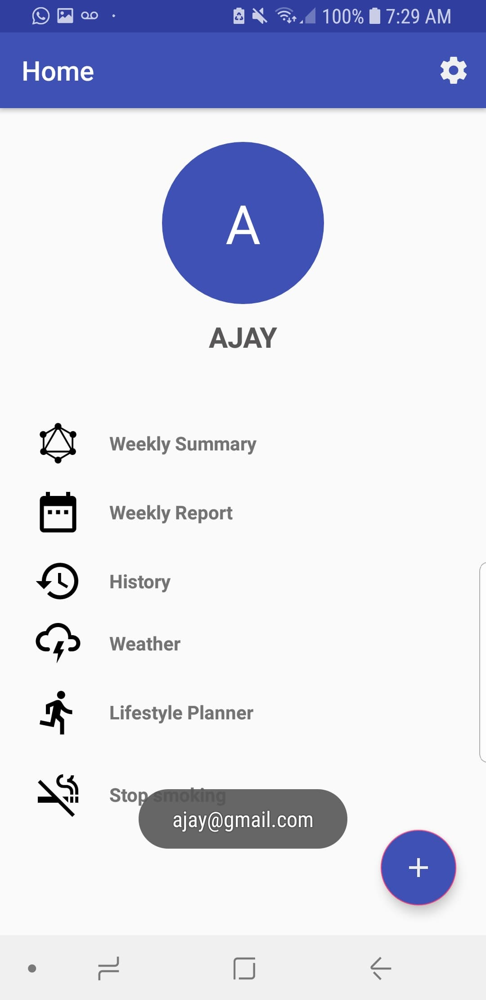
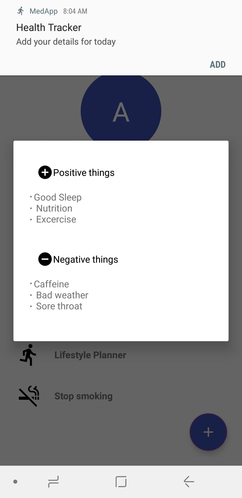

# Med Tracker

Project completed during HackUMass 2018

A daily health tracker where you get notified to add entries daily. Weekly graphs and summary is posted, once you enter 6 times.

Uses recycler views, SQLite database, Graphview, and various other elements to show the details.

Works on a tenser model to predict the best food, medication by comparing the patient to thousands of users.

### Screenshots

Using libraries from AndroidMultiSelectDialogy from Abumoallim & GraphView.

Icons from [materialdesignicons.com](materialdesignicons.com)

MIT License 2018
